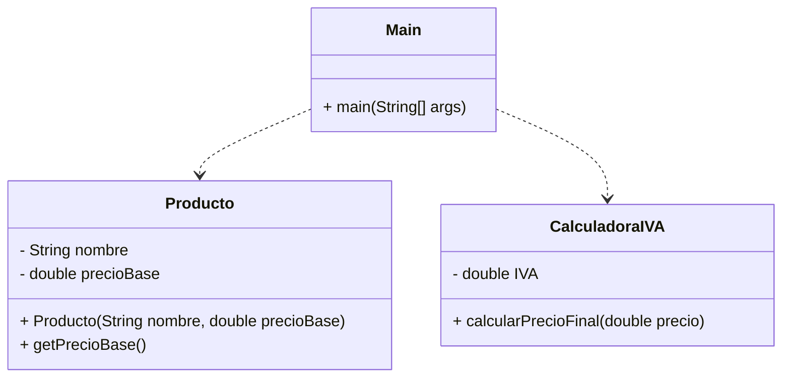

# 📚 Guía: Lenguajes de Marcas, Programación y Modelado

## Objetivo

Comprender la diferencia entre:
- Lenguajes de marcas
- Lenguajes de programación
- Lenguajes de modelado

Y saber clasificarlos correctamente en el contexto del desarrollo de software.

## ¿Qué es un lenguaje de marcas?

Un **lenguaje de marcas** es un lenguaje que sirve para **estructurar información** mediante etiquetas o símbolos.

- No ejecuta lógica.
- No realiza cálculos.
- No toma decisiones.
- Sólo **describe estructura o formato**.


## Ejemplo 1: HTML

**HTML (HyperText Markup Language)**
Se utiliza para estructurar páginas web.

```html
<h1>Título</h1>
<p>Texto de ejemplo</p>
```

✔ Define estructura
❌ No ejecuta lógica

## Ejemplo 2: Markdown (MD)

Lenguaje de marcas ligero.
# Título
## Subtítulo
**Texto en negrita**
- Elemento 1
- Elemento 2

✔ Formatea texto
✔ Se convierte normalmente en HTML
❌ No ejecuta lógica


## Ejemplo 3

classDiagram
class Calculadora {
  +sumar()
}

✔ Describe diagramas
✔ Es declarativo
❌ No ejecuta lógica

## ¿Qué es un lenguaje de programación?

Un lenguaje de programación sirve para:
- Ejecutar instrucciones
- Realizar cálculos
- Tomar decisiones
- Crear aplicaciones

❌ JavaScript NO es lenguaje de marcas
let a = 5;
let b = 3;
console.log(a + b);

✔ Tiene variables
✔ Tiene lógica
✔ Ejecuta instrucciones
❌ No es lenguaje de marcas

## 3 ¿Qué es UML?
UML (Unified Modeling Language) es un lenguaje de modelado visual.
Sirve para representar gráficamente:
- Clases
- Relaciones
- Estados
- Secuencias
- Arquitectura del sistema
- No es un lenguaje de marcas.
- No es un lenguaje de programación.

Es un lenguaje de modelado.

**Ejemplo conceptual de clase UML:**
+-------------------+
|   Calculadora     |
+-------------------+
| +sumar()          |
| +restar()         |
+-------------------+

## Clasificación Final
Elemento	¿Lenguaje de marcas?	Tipo real
HTML	✅ Sí	Lenguaje de marcado estructural
Markdown	✅ Sí	Lenguaje de marcado ligero
Mermaid	✅ Sí	Lenguaje de marcado para diagramas
JavaScript	❌ No	Lenguaje de programación
UML	❌ No	Lenguaje de modelado visual

## Regla sencilla para clasificar

Si:
Estructura contenido → Lenguaje de marcas
Ejecuta instrucciones → Lenguaje de programación
Representa sistemas gráficamente → Lenguaje de modelado
Relación con Ingeniería del Software

**En un proyecto real:**
- Se modela el sistema con UML.
- Se documenta con Markdown.
- Se representa estructura web con HTML.
- Se programa la lógica con Java, JavaScript, etc.
- Se pueden generar diagramas con Mermaid dentro de Markdown.

## Actividades

Clasifica los siguientes elementos:
- CSS
- XML
- JSON
- Python
- PlantUML
- SQL

Indica si son:
- Lenguaje de marcas
- Lenguaje de programación
- Lenguaje de modelado
- Otro tipo (explica cuál)
- ## Diagrama de Clases




