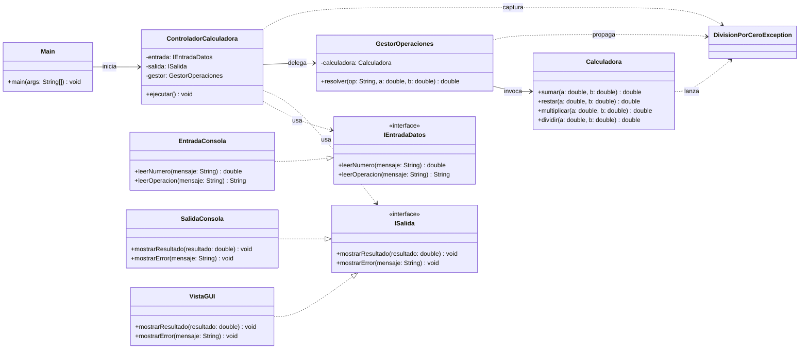

```mermaid
classDiagram
direction LR

class Main {
  +main(args: String[]) void
}

class ControladorCalculadora {
  -entrada: IEntradaDatos
  -salida: ISalida
  -gestor: GestorOperaciones
  +ejecutar() void
}

class GestorOperaciones {
  -calculadora: Calculadora
  +resolver(op: String, a: double, b: double) double
}

class Calculadora {
  +sumar(a: double, b: double) double
  +restar(a: double, b: double) double
  +multiplicar(a: double, b: double) double
  +dividir(a: double, b: double) double
}

class DivisionPorCeroException {
}

class IEntradaDatos {
  <<interface>>
  +leerNumero(mensaje: String) double
  +leerOperacion(mensaje: String) String
}

class EntradaConsola {
  +leerNumero(mensaje: String) double
  +leerOperacion(mensaje: String) String
}

class ISalida {
  <<interface>>
  +mostrarResultado(resultado: double) void
  +mostrarError(mensaje: String) void
}

class SalidaConsola {
  +mostrarResultado(resultado: double) void
  +mostrarError(mensaje: String) void
}

class VistaGUI {
  +mostrarResultado(resultado: double) void
  +mostrarError(mensaje: String) void
}

Main --> ControladorCalculadora : inicia
ControladorCalculadora ..> IEntradaDatos : usa
ControladorCalculadora ..> ISalida : usa
ControladorCalculadora --> GestorOperaciones : delega
GestorOperaciones --> Calculadora : invoca

EntradaConsola ..|> IEntradaDatos
SalidaConsola ..|> ISalida
VistaGUI ..|> ISalida

Calculadora ..> DivisionPorCeroException : lanza
GestorOperaciones ..> DivisionPorCeroException : propaga
ControladorCalculadora ..> DivisionPorCeroException : captura

```
