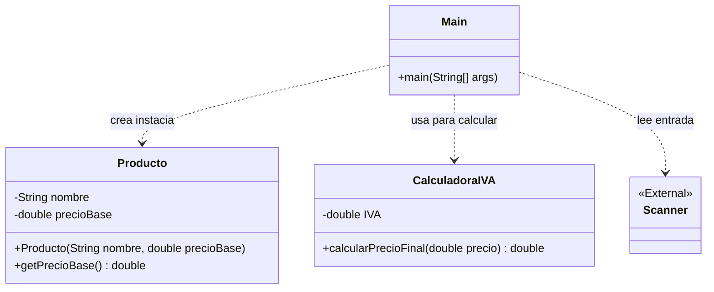
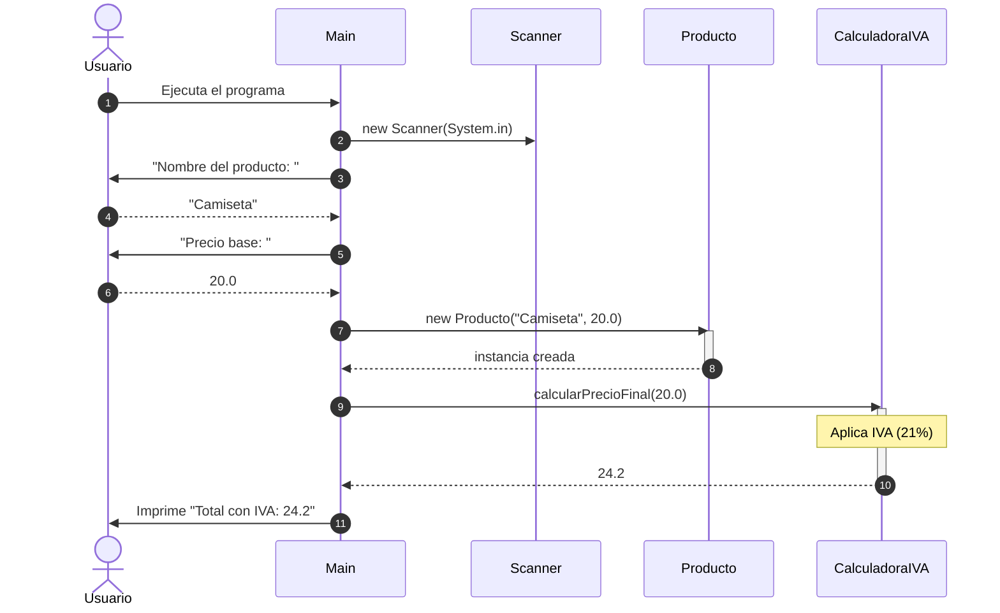

# Crea un UML del siguiente código Java

1. Entra en https://www.planttext.com/
2. Copia el código de ejemplo de abajo
3. Utiliza IA para generar el fiochero en formato UML
4. Pega el código generado en la web planttext.com y genera el diagrama

## Ejemplo de código Java

```java
import java.util.Scanner;

/**
 * Clase que define la estructura de un Producto
 */
class Producto {
    private String nombre;
    private double precioBase;

    public Producto(String nombre, double precioBase) {
        this.nombre = nombre;
        this.precioBase = precioBase;
    }

    public double getPrecioBase() { return precioBase; }
}

/**
 * Clase con la lógica de negocio (Impuestos)
 */
class CalculadoraIVA {
    private final double IVA = 0.21;

    public double calcularPrecioFinal(double precio) {
        return precio * (1 + IVA);
    }
}

public class Main {
    public static void main(String[] args) {
        Scanner sc = new Scanner(System. some);
        CalculadoraIVA calc = new CalculadoraIVA();

        System.out.print("Nombre del producto: ");
        String n = sc.nextLine();
        System.out.print("Precio base: ");
        double p = sc.nextDouble();

        Producto prod = new Producto(n, p);
        System.out.println("Total con IVA: " + calc.calcularPrecioFinal(prod.getPrecioBase()));
    }
}
```
## Código UML generado a partir del código Java



## Explicación de los símbolos:

classDiagram
    class Producto {
        -String nombre
        -double precioBase
        +Producto(String nombre, double precioBase)
        +getPrecioBase() double
    }

    class CalculadoraIVA {
        -double IVA
        +calcularPrecioFinal(double precio) double
    }

    class Main {
        +main(args: String[]) void
    }

    Main ..> Producto : "instancia"
    Main ..> CalculadoraIVA : "usa"
    Main ..> Scanner : "usa"

- (Guion): Significa que el atributo es private. Solo se ve dentro de esa clase.
+ (Más): Significa que el método es public. Se puede llamar desde fuera (como el constructor de Producto).
Flechas punteadas ..>: Indican una dependencia. Significa que la clase Main necesita a las otras para funcionar, pero no "son" parte de ella permanentemente (solo las usa en el método main).
<<External>>: Es una nota para indicar que Scanner no lo hemos programado nosotros, sino que viene de la librería de Java (java.util).

## Diagrama de secuencia:



## Diagrama de estados:

```mermaid
stateDiagram-v2
    [*] --> EsperandoDatos: Inicio del programa
    
    state EsperandoDatos {
        [*] --> LecturaNombre
        LecturaNombre --> LecturaPrecio: Nombre ingresado
        LecturaPrecio --> DatosCompletos: Precio ingresado
    }
    
    EsperandoDatos --> ObjetoInstanciado: Constructor Producto(n, p)
    
    state ObjetoInstanciado {
        [*] --> CalculandoIVA
        CalculandoIVA --> PrecioFinalListo: aplicar 21%
    }
    
    PrecioFinalListo --> [*]: Mostrar resultado y finalizar
```mermaid
